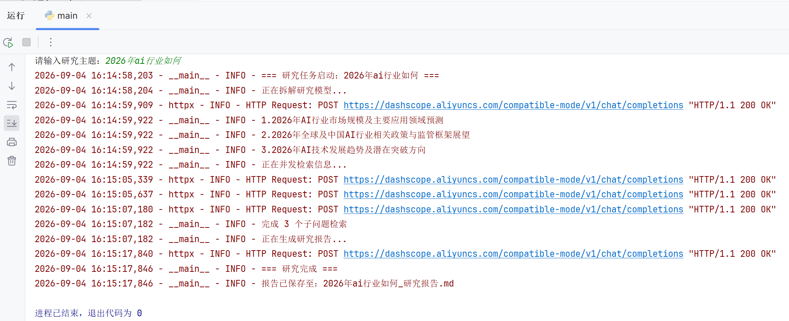
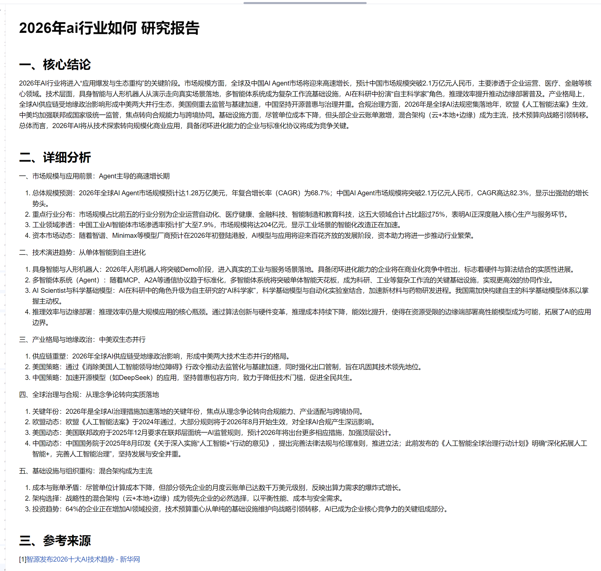

# AI 研究报告助手

> 基于**预搜索与静态规划方案**的自动化调研工具。输入研究主题，程序自动拆分检索维度、联网获取资料、提取结构化笔记，最终输出附带参考来源的完整 Markdown 调研报告。


## 技术栈
- **LangChain**：大模型封装、结构化输出能力
- **Tavily Search API**：互联网实时检索
- **Pydantic v2**：强类型约束，统一项目数据契约
- **asyncio**：异步IO，实现多任务并发搜索
- **requests**：同步HTTP请求，配合线程池完成网络调用
- **python‑dotenv**：环境变量管理

## 项目特性
- **异步并发检索**：多个子问题并行发起网络请求，缩短整体调研耗时
- **Pydantic 结构化约束**：稳定控制LLM输出格式，降低解析失败概率
- **完整多级降级容错**：主题拆解失败、笔记提取失败、报告生成失败三层兜底策略，保证任务始终可以产出结果
- **智能重试策略**：指数退避算法，专门处理网络超时、429限流、5xx服务端异常
- **引用自动去重**：最终报告合并重复网页链接，整理规范参考来源
- **全链路日志系统**，区分INFO/WARNING/ERROR日志等级，便于定位链路异常

## 项目目录
Research-Agent-Demo/  
├── assets/ # 项目截图、静态资源  
├── schemas.py # Pydantic 数据模型定义  
├── tools.py # Tavily 搜索封装、重试逻辑、内存缓存  
├── main.py # 核心业务流程、异步任务调度、Markdown 报告渲染  
├── .env.example # 环境变量配置模板  
├── requirements.txt # Python 依赖清单  
├── .gitignore # Git 忽略规则  
└── README.md  

## 快速启动
### 1. 克隆仓库
```
git clone https://github.com/ERSAI666/research-assistant.git
cd research-assistant
```
### 2.安装依赖
```
pip install -r requirements.txt
```
### 3. 配置环境变量
**Linux / MacOS**
```
cp .env.example .env
```
**Windows（PowerShell）**
```
copy .env.example .env
```
打开 `.env` 文件，填入自己的通义千问、Tavily 搜索 API 密钥。

### 4. 启动程序
```
python main.py
```
输入研究主题，等待程序自动完成调研，报告将自动保存至项目根目录。

## 运行示例
输入主题后，程序会自动完成拆解、搜索、生成报告的全流程。


生成的报告包含核心结论、详细分析和参考来源。


## 方案选型说明
当前项目选用预搜索静态规划方案，而非基于 LangGraph 的自主 Agent 方案。 

• 优点：
1. 整体 LLM 调用次数更少，Token 成本更低；
2. 检索维度提前锁定，输出结果稳定性、可控性更高；
3. 并行执行搜索，整体执行速度更快，调试链路简单。

• 短板：  
关键词在任务一开始就固定，无法根据新搜索到的信息动态追加检索，不适合深度探索式调研。  

>选型结论：当前方案适合固定主题、一次性快速产出调研报告；如果后续需要支持动态深挖、无限多轮检索，可以迁移至 LangGraph 实现自主 Agent。


## 当前已知局限与迭代计划

- 内存全局缓存没有 TTL 过期机制，失败结果会永久缓存，长期运行存在隐患；计划重构为带时间戳的缓存或者接入 Redis实现分布式缓存。
- 没有并发信号量限制，极端情况下大量并发搜索耗尽线程池；后续可增加`asyncio.Semaphore`控制同时请求上限，避免触发API限流。
- 采用预搜索架构，关键词在任务开始时固定，无法根据初步结果进行追问或补充检索，导致报告深度受限；可在现有架构基础上增加一轮补充检索，或者完整迁移到 LangGraph 实现自主规划 Agent。
